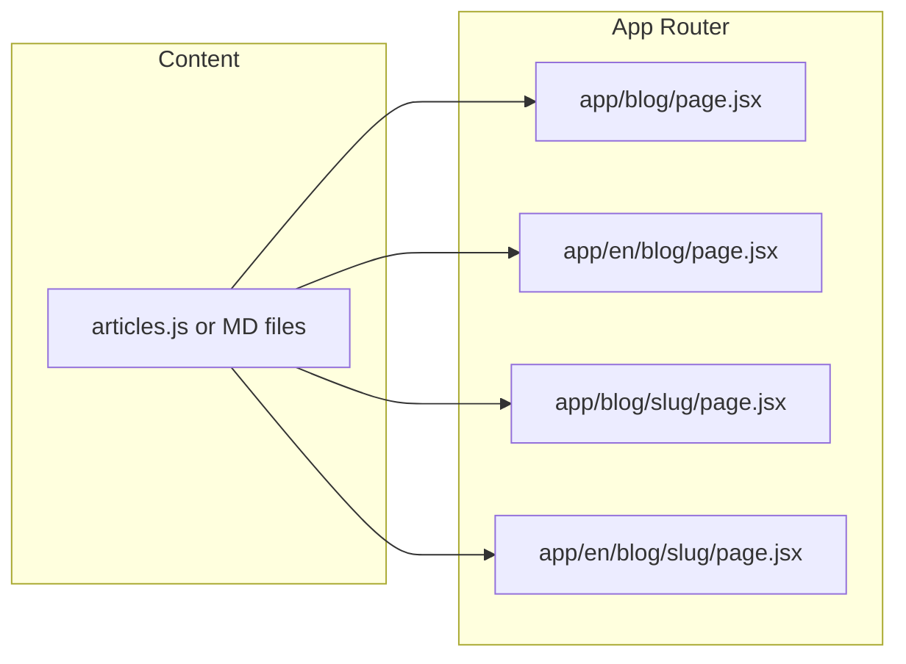

# Blog: Education and News (/blog)

## Current state

- **Stack**: Next.js 15 App Router, React 18, single main app in [app/ClientApp.jsx](app/ClientApp.jsx) with tabs (Calculator, Goal Planner, Compare).
- **Routing**: `/` (Armenian), `/en` (English); language is derived from pathname. No blog or "Education and News" section exists yet.
- **Styling**: Inline styles + theme tokens (DARK/LIGHT) in ClientApp, Inter font, [app/globals.css](app/globals.css) minimal.
- **Header**: Logo, title, subtitle; actions (EN/HY, Print, Excel, theme). No nav link to other sections.

## Route structure

Use the same locale pattern as the rest of the app:

- **Armenian**: `app/blog/page.jsx` (list), `app/blog/[slug]/page.jsx` (article).
- **English**: `app/en/blog/page.jsx` (list), `app/en/blog/[slug]/page.jsx` (article).

Blog pages will use the root layout (same font, viewport). They need a shared header that includes a link back to the calculator and "Education & News" as the active section, plus language switcher (EN/HY) and theme, so the blog feels part of Saving.am.

## Content architecture

- **Single source of truth**: `content/blog/` (or `lib/blog/`) with:
  - `articles.js` (or `articles.ts`): array of article objects.
  - Each article: `slug`, `category`, `date` (ISO), `titleEn`, `titleHy`, `excerptEn`, `excerptHy`, `bodyEn`, `bodyHy`. Optionally `readingTime`, `relatedSlugs`.
- **Categories** (used for filtering and labels):
  - **Taxes & Regulation** — tax article.
  - **Guarantees & Safety** — deposit guarantee article.
  - **How Banks Work** — how banks calculate interest, interest frequency.
  - **Products & Terms** — fixed vs accumulative, early withdrawal, deposit term, AMD vs FX.
  - **Education** — compound interest explained, how to use the calculator.

Articles can be stored as Markdown and parsed at build time (e.g. `content/blog/posts/*.md` + gray-matter) or as JS/JSON with HTML or React fragments for body. For 10 articles and simple i18n, **JS/JSON with structured body (e.g. sections array or HTML string)** is enough; Markdown is optional if you prefer.

## 10 core articles (titles and categories)

| #   | Topic                                                                 | Category            |
| --- | --------------------------------------------------------------------- | ------------------- |
| 1   | How deposit interest is taxed in Armenia                              | Taxes & Regulation  |
| 2   | Deposit guarantee explained (DGF, 16M AMD limit)                      | Guarantees & Safety |
| 3   | How Armenian banks calculate interest                                 | How Banks Work      |
| 4   | Fixed vs accumulative deposits                                        | Products & Terms    |
| 5   | Early withdrawal penalties explained                                  | Products & Terms    |
| 6   | Compound interest explained for savers                                | Education           |
| 7   | Choosing the right deposit term in Armenia                            | Products & Terms    |
| 8   | AMD vs foreign currency deposits: what to consider                    | Products & Terms    |
| 9   | Understanding interest payment frequency (annual, quarterly, monthly) | How Banks Work      |
| 10  | How to use the Saving.am deposit calculator                           | Education           |

Each article should be **written in full** in English and Armenian (or EN first with placeholders for HY), 400–800 words minimum, with clear headings, short paragraphs, and internal links to the calculator and related articles to build domain authority and SEO.

## UI/UX design (modern, categorized)

- **Blog list page**
  - Sticky header consistent with main app: Saving.am logo (links to `/` or `/en`), "Education & News" as current section, EN/HY switcher, theme toggle. Same theme tokens (T) so dark/light matches the calculator.
  - Hero: "Education & News" title + short subtitle (e.g. "Guides and updates on deposits and savings in Armenia").
  - **Category pills** (horizontal, scroll on mobile): All, Taxes & Regulation, Guarantees & Safety, How Banks Work, Products & Terms, Education. Filter client-side or via query (`?category=...`).
  - **Article grid**: Cards in a responsive grid (e.g. 1 col mobile, 2–3 cols desktop). Each card: category label (small, colored), title, excerpt, date, optional reading time; click → article page. No images required initially; optional small icon or gradient per category.
  - Footer: Same as calculator (Made with … Codeman Studio, disclaimer) plus optional "Back to Calculator" link.
- **Article page**
  - Same header. Breadcrumb: Home > Education & News > [Category] > [Title].
  - Article hero: category, title, date, reading time.
  - Body: Prose layout (max-width ~720px, good line-height and spacing). Support headings (H2/H3), paragraphs, lists, and optional callouts (e.g. for guarantee limit, tax rate).
  - Optional: simple in-page table of contents for long articles (anchor links to H2/H3).
  - Bottom: "Related articles" (2–3 by `relatedSlugs` or same category), then CTA card: "Estimate your savings →" linking to `/` or `/en`.
- **Responsive**: Reuse existing breakpoints/patterns from ClientApp (e.g. 768px, 480px) so the blog works on the same devices.

## Integration with main app

- **Header in ClientApp**: Add an "Education & News" (or "Blog") link next to the logo or as the first action: `router.push(lang === 'en' ? '/en/blog' : '/blog')`. Label from TRANSLATIONS: e.g. `blog_nav: "Education & News"` / `"Կրթություն և Խորհուրդներ"`.
- **Footer in ClientApp**: Add a text link "Education & News" or "Blog" in the footer that goes to `/blog` or `/en/blog` (by current lang).
- **Blog layout**: Reuse the same header/footer component or a shared `BlogLayout` that mirrors the calculator header (logo, Blog active, EN/HY, theme) so navigation is consistent.

## SEO and domain authority

- **Metadata**: Per-article `generateMetadata` (title, description from excerpt, OG, canonical). List page: "Education & News | Saving.am".
- **Structured data**: Article schema (headline, datePublished, author, description) on each article page; optional BreadcrumbList.
- **Internal linking**: Calculator FAQ and footer link to blog; blog articles link to calculator and to related posts.
- **URLs**: Clean slugs, e.g. `/blog/how-deposit-interest-is-taxed-armenia`, `/en/blog/deposit-guarantee-explained`.
- **Content**: Authoritative, accurate content on RA tax (10%), DGF (16M AMD), typical penalties (2% AMD, 1.5% FX), compounding; cite or note "per RA law" / "check with your bank" where appropriate.

## File and data flow

- **Shared**: `getArticles()`, `getArticleBySlug(slug)`, `getCategories()` from a single module (e.g. `lib/blog.js`) used by all four route pages. For `[slug]`, use `generateStaticParams` from the articles list for static generation.

## Implementation order (suggested)

1. **Content layer**: Create `content/blog/articles.js` (or equivalent) with the 10 article slugs, categories, dates, titles, excerpts, and full body text (EN + HY). Write the 10 articles (or EN first, HY stub).
2. **Lib**: `lib/blog.js` (or `app/blog/lib.js`) with `getArticles(lang)`, `getArticleBySlug(slug, lang)`, `getCategories()`.
3. **Blog layout component**: Shared header + footer for blog (logo, Education & News, EN/HY, theme), used by list and article pages.
4. **List page**: `app/blog/page.jsx` and `app/en/blog/page.jsx` — fetch articles, render category filter and card grid; use BlogLayout.
5. **Article page**: `app/blog/[slug]/page.jsx` and `app/en/blog/[slug]/page.jsx` — fetch by slug, render prose, related, CTA; `generateMetadata`, `generateStaticParams`; use BlogLayout.
6. **Navigation**: Add "Education & News" link and translations in ClientApp header and footer; ensure blog header links back to `/` or `/en`.
7. **Polish**: Article schema (JSON-LD), breadcrumbs, reading time, optional TOC for long posts.

## Summary

- **Routes**: `/blog`, `/blog/[slug]`, `/en/blog`, `/en/blog/[slug]`.
- **Content**: 10 articles in a single data module (or Markdown), bilingual, with categories.
- **UI**: Category-filtered list + prose article pages, same theme and header/footer pattern as the calculator, with "Education & News" in the main app nav and footer.
- **SEO**: Metadata, Article schema, internal links, and full, accurate content to build domain authority.

